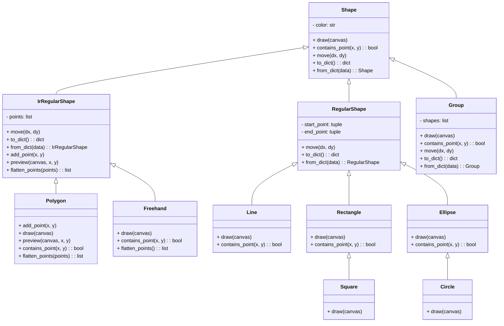

In a Human-Computer Interface class, one of the assignments was to design a sketchpad. At the time, I completed most of the features, though not all. Looking back, it was an interesting task that allowed me to practice a variety of concepts, including object-oriented programming, state management, and exploring how we interact with applications. Recently, I revisited the project, completed all the features, and added some improvements based on my understanding. Here, I will document my thought process.

### Requirements

Let’s begin by listing the key requirements for the sketchpad application:

- Straight lines
- Rectangles and squares
- Ellipses and circles
- Scribbled freehand lines
- Polygons, including open and closed polygons
- Color selection
- Move
- Cut, copy, and paste
- Delete
- Group/Ungroup
- Undo/Redo
- Save/Load

### Programming Language Choice

This project does not impose any restrictions on the programming language, so we are free to choose one that suits us. I have experience with Java, Python, and HTML/CSS/JavaScript. After some consideration, I decided to use Python because of the following reasons:

Python's flexibility and simplicity make it well-suited for rapid development.
Tkinter, Python’s default GUI library, is lightweight and capable enough for the requirements of this project. It is also included by default, which simplifies setup and development.

### Class Design

To ensure the code is well-organized, readable, and maintainable, I opted for an object-oriented programming (OOP) approach. Lets analyse the classes here, 1. circles and squares are a special case for Ellipses and Rectangles. 2. When draing circles there are two approaches here, first is start from the centre or origin O, and the distance mouse moves is the radius R, second is like drawing a square, and put the circle into the square, I like the second approach better, because it allow me to control the size better 3.When considering Serialization/Deserialization, for the  'regular' shapes like Straight lines, Rectangles, Ellipses they can be decided by two point, the starting point and ending point,(assuming when drawing Ellipse, we drawing this Ellipse inside the Rectangle our mouth defined).   for  the IrRegular Shapes(Freehand and Polygon), actually they are a series of points. we can determin the shape jsut by connecting all these points together.  4, as for  open Polygon and closed Polygon, do we need another property to judge? actually a closed polygon is just the ending point is the first point, while for open polygon, the ending point is diffrent from the first point. so we can decide by this. Tkinter have a  create_polygon function, but it can only draw closed polygon, so it is a bit confusing, and we wouldn't use it. 5. as for color, as for we only need line color, not the filling color, all shapes have one color property. So, the final class design is we have an overarching class [Shape] with property [color], a RegularShape class with the  Below is the final class design for the project:

### Beheivior Design

It's easy to draw shapes on a canvas, since tinker  already has some of these methods. But it is another thing to dig deeper. I'll try to list the considerations here.

1. open and closed polygon.

tinker canvas have a built-in draw polygon method, but it can only draw closed polygon. An open polygon is in fact a few lines connected together. and in fact tinker canvas support this approach. we can use drawline method to draw open polygons. on a further thought, if the last point == the first point, it would be a closed polygon. so we will use drawline to draw both closed and open polygon.

How to draw.
to give user a clear view of the current drawing line, we use a preview dotted line. when user clicked and while mouse moving, this line will show to give a guidence.
How to close: 1 if the mouse clicks near the first point, we will assume that the user want to close this polygon. and snaps to close this polygon.
2. if user want to draw open polygon, he will need to click right button to indicate the last point. then it will be a closed polygon.
3 if user change mode (to other shapes or editing tools) during drawing, the polygon will be open. and the last point will be the clicked point before changing mode.

2.select/moving mode
The simplist way is to have a move button, and when in this mode, mouse drag on shapes to move.
but it is usually not how we interact with a app.
Here I added some behivor features based on how we use file exploer to select/move files
1.single click to select, drag to move
2. if Ctrl is pressed, can select multiple files.
3, if mutiple shapes are selected, 
        1.click on one of then will de-select others(only the current is selected), click on blank space will de-select all. 
        2. drag on one will move them all.(I tested this on file exploer)
4. if Ctrl is pressed and mutiple shapes are selected, 
    1. click a shape will change the select status (click on selected will de-select it, click on un-selected will select it)
    2. drag on one will move them all.(I tested this on file exploer)

This is the hardest part, if you look at the code, I used many if else to decide the code flow.

3. how to know if an action is a click or a drag.
for one mouse button, there are three event. in tinker, they are:

button down <Button-1>
moude move while button down<B1-Motion>
button up <ButtonRelease-1>

whether a user actoin is a drag or a click, we can not judge on button down event, since they are all the same, 
the method is to judge during moude move while button down event<B1-Motion>.  we set a small threshold, if the mouse move more than the threshold, we consider it a drag, if not(normal click might have some shaky hands), we consider it a click.
From stackoverflow, I learned this this is how windows handle it.

